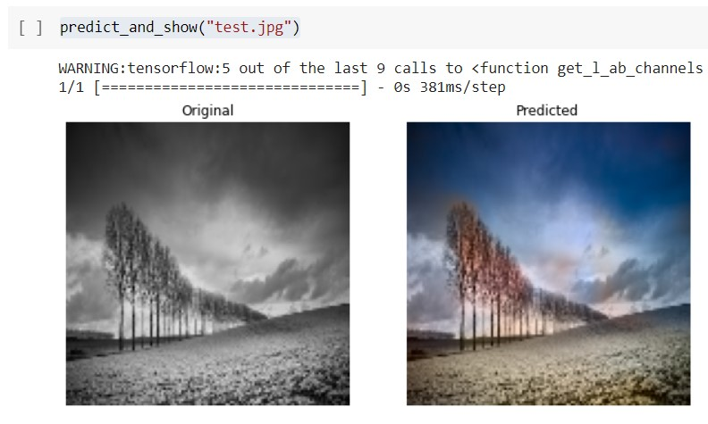
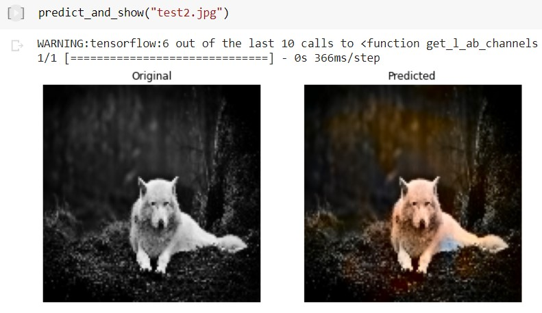

<h1 align="center">Image Colorization</h1>

    
  
  

## Problem statement

Before Artificial Intelligence, image colorization was reserved to artists that aimed to give the original colors to a picture. In fact, professional image colorization is currently done by hand in Photoshop. Despite it is a challenging problem due to the multiple image conditions that need to be considered, nowadays, deep learning techniques have achieved promising results in this field.

This project aims to study the Image Colorization problem and implement a Deep Neural Network that is able to colorize black and white images using [CIELAB color space](https://en.wikipedia.org/wiki/CIELAB_color_space).

## Implementation

First, two image datasets will be collected and pre-processed, including the conversion to the CIELAB color space. Next, several Deep Neural Network (DNN) architectures including Convolutional Neural Networks (CNNs) and Autoencoders will be implemented using Tensorflow. Finally, the evaluation metric Mean Squared Error (MSE) will be selected to choose which of the implemented models performs better.

The [project notebook](notebooks/image_colorization.ipynb) is structured in the following sections:

- **Data Preprocessing**: This section covers the preprocessing applied to the input data, including
the conversion from rgb image to lab, the creation of the training and validation sets, and the
configuration of tensorflow data pipelines for a higher performance during training.

- **Models**: It contains the implementation using Keras of the three models CNN, Autoencoder and CNN using Transfer Learning, alongside the trainable parameters for each one.

- **Train Stage**: One of the previous models can be selected and trained with the images found in
the training set. In each epoch, the validation accuracy and loss is printed. At the end of the
training, the accuracy-loss plot is displayed for both train and validation set.

- **Test Stage**: It retrieves one batch of the validation set and prints 4 predictions compared to
their original images.

- **Convert custom pictures**: An image path can be added containing a black and white image and
the best model is used to predict its respective image in color.

### Data

Two public datasets were used:

- [Flickr 30k dataset](https://www.kaggle.com/adityajn105/flickr30k): a public dataset which contains 30 thousand images in 200x200 resolution. It has become a standard benchmark for image captioning, but because of the variety of images that it contains, this dataset was used for final training and validation of the models [2].
- [Flickr 8k dataset](https://www.kaggle.com/kunalgupta2616/flickr-8k-images-with-captions): a subset of the previous dataset containing 8 thousand images in 200x200 resolution. It was used mostly for initial training of the models to understand the performance of the implemented models [3].

### Tools

The tools utilized for this project include:

- Python 3.7.
- Tensorflow 2.4 with Keras: open-source framework for machine learning and deep learning applications. It was used to preprocess input data, create data pipelines and train models with different Keras layers.
- Multiple python libraries, such as NumPy and matplotlib.

## Usage

### Training the model

In order to train the model, the following steps should be followed:

1. Download [Flickr 30k dataset](https://www.kaggle.com/adityajn105/flickr30k) and export the images in to a new folder called _ImageLarge_ in the current [data](data) folder.
2. Select training parameters found in the _Train Stage_ section on the notebook.
3. Fit the model with the new data and configuration. Optionally, the resulting model can be saved to use in the test stage.

### Running demo

On the notebook developed, the last section was created to use as a demonstration and colorize custom pictures. In order to use it, the following steps need to be followed:

- Download the best weights [cnn_model_last.h5](https://drive.google.com/uc?export=download&id=1KI9fCihX3c2DpU_s6XCJGCngpxZeEcOM) of the model trained and store it in a new folder called _model/cnn_model_last.h5_.
- Run all cells before the _Train Stage_ section and the ones in _Convert custom pictures_ section.
- After that, run the helper function _"predict_and_show"_ can be used to convert the picture contained in the path passed as argument.

Below are presented some examples of the test images [test.jpg](data/test.jpg) and [test2.jpg](data/test2.jpg) found in data folder.

## Authors

- Angel Igareta ([angel@igareta.com](mailto:angel@igareta.com))
- Serghei Socolovschi ([serghei@kth.se](mailto:serghei@kth.se))
